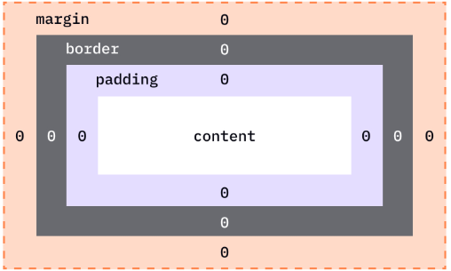

## What Is the CSS Box Model?
---

:::note
- The **[CSS Box Model](https://developer.mozilla.org/en-US/docs/Web/CSS/CSS_box_model)** is the foundation of how HTML elements **are displayed** on a **webpage**.
- Every HTML element is treated as a **rectangular box**, and the box model determines how the **content**, **padding**, **borders**, and **margins** of that element interact.
- The box model defines how the elements' **dimensions** and **space** are calculated. It is essential for **managing layout** and **spacing**.
:::

## Components of the CSS Box Model
---

The box model consists of **four main components**, from the inside out:  

      

1. **Content**: 
   - This is the **actual content** of the box, such as text, images, or other media. It is the **innermost part** of the box and defines the size of the element's core area.
   - You **can control** the **size** of the content box using properties like **`width`** and **`height`**.

2. **Padding**:
   - Padding is the **space between** the **content and the border**. It provides inner spacing within the box to ensure the content doesn't touch the border directly.
   - Padding is **transparent** and can be adjusted individually for **each side**: **`padding-top`**, **`padding-right`**, **`padding-bottom`**, and **`padding-left`**.

3. **Border**:
   - The border **surrounds the padding** (if any) and **content**. It can have a width, color, and style (e.g., solid, dotted, dashed).
   - You can style the border using properties like **`border-width`**, **`border-style`**, and **`border-color`**.

4. **Margin**:
   - The margin is the **outermost space** around the border, **separating** the element **from other elements** on the page.
   - Margins are **transparent**, and like padding, they can be adjusted on **each side**: **`margin-top`**, **`margin-right`**, **`margin-bottom`**, and **`margin-left`**.
   - The margin also helps with **positioning** and **spacing between** elements. 


## Computed Dimensions of an Element 
---
The total **width** and **height** of an element are calculated as follows:

- **Total width** = `width` + `padding-left` + `padding-right` + `border-left` + `border-right`
- **Total height** = `height` + `padding-top` + `padding-bottom` + `border-top` + `border-bottom`

## Box-sizing Property
---

- **`box-sizing`** property controls how the **total width** and **height** of an element are calculated.
- By default, the `width` and `height` properties include only the **content area**. However, you can change this behavior using the `box-sizing` property:

:::note
1. **`box-sizing: content-box;`** (**default**): The `width` and `height` are applied only to the content area.
2. **`box-sizing: border-box;`**: The `width` and `height` include padding and border, so the total size of the element will stay within the specified dimensions.
:::

### 1. Content Box
- The default value for the box model is `box-sizing: content-box;`, meaning the width and height apply to the content area only, and the padding, border, and margin are added outside of it.

Example:
```css
div {
    width: 300px;
    height: 200px;
    padding: 20px;
    border: 5px solid black;
}
```

Here, the total width of the element would be:
- 300px (content width) + 20px (left padding) + 20px (right padding) + 5px (left border) + 5px (right border) = 350px

### 2. Border Box
- If you want the total width and height to include padding and borders, use `box-sizing: border-box;`.

Example:
```css
div {
    box-sizing: border-box;
    width: 300px;
    height: 200px;
    padding: 20px;
    border: 5px solid black;
}
```

Now, the total width of the element will remain **300px**, including the padding and border.

## List of Box Model CSS Properties

---
| **Property**            | **Description**                                                                 | **Shorthand**                             | **Example**                                                   |
|-------------------------|---------------------------------------------------------------------------------|-------------------------------------------|---------------------------------------------------------------|
| `width`                 | Specifies the width of the content area.                                         | -                                         | `width: 200px;`                                               |
| `height`                | Specifies the height of the content area.                                        | -                                         | `height: 150px;`                                              |
| `padding`               | Controls the space between the content and the border. Can be set for each side. | `padding: top right bottom left;`         | `padding: 10px 20px 30px 40px;`                               |
| `border`                | Defines the border around the content. Can include width, style, and color.      | `border: width style color;`              | `border: 2px solid red;`                                      |
| `margin`                | Defines the space outside the border. Can be set for each side.                  | `margin: top right bottom left;`          | `margin: 10px 20px 30px 40px;`                                |
| `box-sizing`            | Specifies how the total width and height are calculated (including padding/border). | -                                         | `box-sizing: border-box;`                                      |
| `border-width`          | Sets the thickness of the border.                                                | `border-width: top right bottom left;`    | `border-width: 2px 4px 6px 8px;`                               |
| `border-style`          | Defines the style of the border (e.g., solid, dotted, dashed).                   | `border-style: top right bottom left;`    | `border-style: solid dashed dotted double;`                     |
| `border-color`          | Specifies the color of the border.                                               | `border-color: top right bottom left;`    | `border-color: red blue green yellow;`                         |
| `padding-top`           | Specifies padding on the top of the content.                                     | -                                         | `padding-top: 10px;`                                           |
| `padding-right`         | Specifies padding on the right of the content.                                   | -                                         | `padding-right: 20px;`                                         |
| `padding-bottom`        | Specifies padding on the bottom of the content.                                  | -                                         | `padding-bottom: 30px;`                                        |
| `padding-left`          | Specifies padding on the left of the content.                                    | -                                         | `padding-left: 40px;`                                          |
| `margin-top`            | Specifies margin on the top of the element.                                      | -                                         | `margin-top: 10px;`                                            |
| `margin-right`          | Specifies margin on the right of the element.                                    | -                                         | `margin-right: 20px;`                                          |
| `margin-bottom`         | Specifies margin on the bottom of the element.                                   | -                                         | `margin-bottom: 30px;`                                         |
| `margin-left`           | Specifies margin on the left of the element.                                     | -                                         | `margin-left: 40px;`                                           |

### Examples:
- **Padding Shorthand**:
   ```css
   padding: 10px 20px 30px 40px; 
   /* top: 10px, right: 20px, bottom: 30px, left: 40px */
   ```
   
- **Margin Shorthand**:
   ```css
   margin: 15px 25px 35px 45px; 
   /* top: 15px, right: 25px, bottom: 35px, left: 45px */
   ```

- **Border Shorthand**:
   ```css
   border: 2px solid red; 
   /* width: 2px, style: solid, color: red */
   ```

- **Box-Sizing**:
   ```css
   box-sizing: border-box; 
   /* Includes padding and border in width/height */
   ```

### Examples of Two-Value Shorthand:

- **Padding (Two Values)**:
   ```css
   padding: 10px 20px;
   /* top and bottom padding: 10px, left and right padding: 20px */
   ```

- **Margin (Two Values)**:
   ```css
   margin: 15px 25px;
   /* top and bottom margin: 15px, left and right margin: 25px */
   ```

:::tip
- When you specify **two values** for `margin` or `padding`, the first value applies to the **top and bottom**, while the second value applies to the **left and right**.
- If you provide **one value**, it applies to **all four sides** (top, right, bottom, left). When two values are given, the first applies vertically (top and bottom), and the second applies horizontally (left and right).
:::


## CSS Box Model Tips & Best Practices

### Use `box-sizing: border-box;`

```css
* {
    box-sizing: border-box;
}
```

:::tip
- This is the **most common practice** in modern web design. It ensures that **padding** and **border** do **not increase** the size of an element beyond the specified `width` and `height`.
- This rule applies the `border-box` **box model to all elements**, making layout easier to manage, as padding and borders **no longer affect** the overall element size.
:::

### Avoid Fixed Widths in Responsive Designs
- Fixed-width layouts can break on different screen sizes. Use relative units like percentages (`%`) or viewport units (`vw`, `vh`) instead of fixed pixel values for better responsiveness.

Example:
```css
div {
    width: 50%; /* This makes the width flexible */
}
```

### Negative Margins
- Negative margins allow you to **pull an element closer** or **overlap other elements**. Use these carefully, as they can affect layout unpredictably.

Example:
```css
div {
    margin-left: -20px; /* Pulls the element 20px to the left */
}
```

### Collapsed Margins
- When **vertical margins** (top and bottom) of adjacent block elements meet, they collapse into a single margin. The larger margin value takes effect. This behavior can be avoided using padding or borders.

Example:
```css
div {
    margin-top: 10px;
    margin-bottom: 20px;
}
```
If the divs are adjacent, the total margin between them will be `20px`, not `30px`.

### Centering Elements
- To **center a block element** horizontally, use `margin: 0 auto;` with a **fixed width**.

Example:
```css
div {
    width: 50%;
    margin: 0 auto;
}
```

**For centering vertically and horizontally, use Flexbox or Grid layout systems.**

---

### Debugging the Box Model

When working with the box model, it can be helpful to visually inspect the layout and element boundaries. Use browser developer tools (e.g., Chrome DevTools) to inspect and visualize the padding, borders, and margins around elements.

In DevTools:
- Right-click an element and select "Inspect."
- Look for the "Box Model" section in the right panel, which shows padding, border, and margin dimensions.

---

##  Advanced Topics

### Flexbox and Box Model
- When using Flexbox, the box model still applies, but Flexbox properties (like `justify-content` and `align-items`) control alignment and spacing. Flexbox can help distribute space more efficiently and center elements.

### CSS Grid and Box Model
- CSS Grid provides a two-dimensional layout system where elements are placed into rows and columns. The box model applies to grid items, but you have more control over the size and positioning of elements using grid-specific properties like `grid-template-areas` and `grid-gap`.
